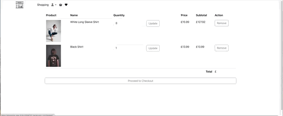

# Shopping New 

This project is a web application built with Flask for the backend and uses SQLite as the database. The application provides an online store for products, allowing users to view products, add them to their favorites or basket, and make purchases.

## Deployed Application

View the deployed site here.


## Application Visuals

<p align="center">
  
  
  
</p>
<p align="center">
  
  
  
</p>


## Responsive Design

<p align="center">
  
  
  
</p>


## 🛠 Technologies Used
#### Backend:

- Python

- Flask

- SQLite

#### Frontend:

- HTML

- CSS

- Python

- Bootstrap


#### Development and Deployment

- Flask Debug Toolbar

- Stripe for payment processing

- Git

- GitHub


## Project Brief:

- Objective: Develop a web application for an online Shopping store.
- Backend: Use Python and Flask to create the application. Data is stored in a SQLite database.
- Frontend: Use HTML, CSS, Python and Bootstrap for the user interface.
- Functionality: The application allows users to view products, add products to their basket or favorites, write reviews, and complete purchases.

- Design: Ensure the application has a clean and user-friendly design.
- Deployment: Deploy the application online to make it publicly accessible.


## Build/Code Process:

### Backend:
The backend is built using Flask and handles user authentication, product management, and order processing.

#### Database Models
The database contains several tables to manage users, products, reviews, baskets, orders, and favorites. Here are some key models:


```paython


import sqlite3

def init_db():
    conn = sqlite3.connect('productdb.db')
    dbCursor = conn.cursor()
    
    dbCursor.execute(
    """ 
        CREATE TABLE IF NOT EXISTS Users (
            user_id INTEGER PRIMARY KEY AUTOINCREMENT,
            username TEXT NOT NULL UNIQUE,
            password TEXT NOT NULL,
            email TEXT NOT NULL UNIQUE
        )"""
    )

    dbCursor.execute(
        """ 
            CREATE TABLE IF NOT EXISTS products (
            id INTEGER PRIMARY KEY AUTOINCREMENT,
            name TEXT NOT NULL,
            description TEXT NOT NULL,
            price REAL NOT NULL,
            image_url TEXT
        )"""
    )
    
    dbCursor.execute(
        """ 
            CREATE TABLE IF NOT EXISTS review (
            Review_id INTEGER PRIMARY KEY AUTOINCREMENT,
            user_id INTEGER,
            product_id INTEGER,
            name TEXT NOT NULL,
            description TEXT NOT NULL,
            FOREIGN KEY (user_id) REFERENCES Users(user_id),
            FOREIGN KEY (product_id) REFERENCES Products(id)
        )"""
    )

    dbCursor.execute(
        """ 
            CREATE TABLE IF NOT EXISTS Basket (
            basket_id INTEGER PRIMARY KEY AUTOINCREMENT,
            user_id INTEGER,
            product_id INTEGER,
            quantity INTEGER,
            FOREIGN KEY (user_id) REFERENCES Users(user_id),
            FOREIGN KEY (product_id) REFERENCES Products(id)
        )"""
    )

    dbCursor.execute(
        """ 
            CREATE TABLE IF NOT EXISTS Orders (
            order_id INTEGER PRIMARY KEY AUTOINCREMENT,
            user_id INTEGER,
            order_date DATETIME,
            total REAL,
            status TEXT,
            FOREIGN KEY (user_id) REFERENCES Users(user_id)
        )"""
    )

    dbCursor.execute(
        """ 
            CREATE TABLE IF NOT EXISTS OrderDetails (
            order_details_id INTEGER PRIMARY KEY AUTOINCREMENT,
            order_id INTEGER,
            product_id INTEGER,
            quantity INTEGER,
            price_at_time_of_order REAL,
            FOREIGN KEY (order_id) REFERENCES Orders(order_id),
            FOREIGN KEY (product_id) REFERENCES Products(id)
        )"""
    )

    dbCursor.execute(
        """ 
            CREATE TABLE IF NOT EXISTS Favorites (
            user_id INTEGER,
            product_id INTEGER,
            PRIMARY KEY (user_id, product_id),
            FOREIGN KEY (user_id) REFERENCES Users(user_id),
            FOREIGN KEY (product_id) REFERENCES Products(id)
        )"""
    )

    conn.commit()
    conn.close()
    
init_db()

```
#### Main Application Logic

The main application file, app.py, handles routes for displaying products, user authentication, basket management, and checkout.

```paython

from flask import Flask, render_template, request, redirect, url_for, session, flash
import sqlite3 as sql
import bcrypt
from flask_debugtoolbar import DebugToolbarExtension
import stripe
from flask_cors import CORS
import sys

print(sys.path)

app = Flask(__name__)
CORS(app)
app.debug = True
app.config['SECRET_KEY'] = 'your_secret_key_here'
stripe.api_key = 'your_stripe_secret_key_here'

@app.route('/')
def home():
    return render_template('home.html', title="Home Page")

@app.route('/products')
def products():
    members = get_members()
    return render_template('products.html', title="Products Page", members=members)

# Additional routes and functions for handling user login, registration, basket, favorites, and checkout

if __name__ == "__main__":
    app.run()
```

### Frontend:

This is the storyController, which manages the functionalities for creating, updating, viewing, and liking a story. I was particularly satisfied with the implementation of permission checks in these functions. It verifies whether the user attempting to update the story is the actual owner, ensuring that only the owner can successfully perform these actions. Additionally, I successfully implemented an override for the admin, allowing them to update stories regardless of their ownership status, achieved by incorporating the condition req.currentUser.role !== "admin".

The storyController also handles viewing all stories and specific comments about a story, providing comprehensive functionality for story management within the application.


```javascript

import City from "../models/city.js";
import multer from 'multer';
import path from 'path';


const create = async (req, res, next) => {

  const  storyData  = req.body;
 
  const { cityId } = req.params;

  const { id: userId } = req.currentUser;
 

  try {
    
    const foundCity = await City.findById(cityId);
    console.log(foundCity);
    console.log(storyData);

    if (!foundCity) {
      return res
        .status(404)
        .json({ message: `City with id ${cityId} not found` });
    }

   
    foundCity.storys.push({ ...storyData , createdBy: userId });

  
    await foundCity.save();

    return res.status(200).json({
      message: "Comment has been successfully added to Story!",
      comment: { storyData , createdBy: userId },
    });
  } catch (err) {
    next(err);
  }
};


const update = async (req, res, next) => {
 
  const dataToUpdate = req.body;
  const { cityId , storyId } = req.params;
 
  const { id: userId } = req.currentUser;

  try {
    const foundCity = await city.findById(catId);

    if (!foundCity) {
      return res.status(404).json({ message: `City with id ${id} not found.` });
    }
    let foundStory = foundCity.storys.id(storyId);
    console.log(foundStory)
    if (!foundStory) {
      return res.status(404).json({ message: `Story with id ${storyId} not found in city ${cityId}` });
    }
    if (
      req.currentUser.id !== foundStory.createdBy.toString() && // did the user create the resource?
     
      req.currentUser.role !== "admin" // is the user an admin?
 
    ) {
      return res.status(403).json({ message: "You cannot edit this story" });
    }
   
    foundStory.set(dataToUpdate);
   
    await foundCity.save();

    return res
      .status(200)
      .json({ message: "Story has been updated", foundStory });
  } catch (err) {
    next(err);
  }
};
=


const liked = async (req, res, next) => {
 
  
  const {  storyId } = req.params;
 
  const { id: userId } = req.currentUser;

  try {
    // First, find the story with the ID and check if the user has already liked it
    const story = await City.findOne({'storys._id': storyId}, {'storys.$': 1});
    const storyToLike = story.storys[0];
    const hasLiked = storyToLike.likes.includes(userId);

    // Based on whether the user has liked it, pull or push the userId
    if (hasLiked) {
      await City.updateOne(
        { _id: story._id, 'storys._id': storyId },
        { $pull: {'storys.$.likes': userId} }
      );
    } else {
      await City.updateOne(
        { _id: story._id, 'storys._id': storyId },
        { $push: {'storys.$.likes': userId} }
      );
    }

    // Fetch the updated likes count
    const updatedStory = await City.findOne({'storys._id': storyId}, {'storys.$': 1});
    const likesCount = updatedStory.storys[0].likes.length;

    return res.json({ success: true, likes: likesCount });
   
  } catch (err) {
    next(err);
  }
};


export default {
  create,
  update, 
  liked
 
};
```


### Frontend:
The website features a home page where users can search for stories via city name. The Tour Browse page displays all cities along with their stories from the database. Users can click on a specific city to view its stories and have the ability to update or create new stories. Additionally, users can leave comments on any story and like the stories. Anyone can create or update a story as long as they are logged in. The site also includes a sign-up and login page. Throughout the project, I have extensively utilized modals for error pop-ups and CRUD functionality.

#### Homepage
I have implemented a search functionality to allow users to find specific stories by city name. The main component representing the homepage is called Home. At the center of the page, there is a search input field where users can enter their search query. As they type, the search query is stored in the search state variable using the useState hook.

To initiate the search, users can click on the search button, which triggers the onSubmit function. This function handles the search submission process. First, it sets the loading state to indicate that the search is in progress. Then, it calls the fetchData function.

The fetchData function is responsible for making an API call to retrieve city data from a specific API endpoint. Using a GET request, the data is received and then filtered based on the search query entered by the user. The filtering is done by checking if the city name includes the search query in a case-insensitive manner.

The filtered results are then stored in the searchResults state variable. If no results are found, a flag called unsuccessfulSearchSubmitted is set to true, which triggers the display of an error modal dialog. The modal informs the user that their search did not yield any results and provides a way to close the dialog.

On the Tour Browse page, users can see all cities along with their stories. Users can click on a specific city to view its stories and have the ability to update or create new stories. The site also includes sign-up and login pages to manage user authentication. Throughout the project, I have extensively utilized modals for error pop-ups and CRUD functionality.

```javascript

const Main = ({count,setCount}) => {
  const [formData, setFormData] = useState("");
  const [errorMessage, setErrorMessage] = useState("");
  const [query, setQuery] = useState('');
  const [results, setResults] = useState({});
  const navigate = useNavigate();
  
  const onChange = (e) => {
    setQuery(e.target.value);
    setErrorMessage("");
  };

  const handleClick = async(e) => {
    if (!query) {
      e.preventDefault();
      setErrorMessage("Please enter the name of your city");
      console.log(errorMessage);
    }else{
      setErrorMessage("");
      try {
        const {data} = await axios.post(`${API_URL}/search/`, { query });
        console.log(data.data[0]);
        console.log(data);
        if (data.data[0]){
          localStorage.setItem("city", JSON.stringify(data.data[0]));
          console.log(results);
          navigate("/tourbrows");

        }else{
          setErrorMessage(data.message);
          console.log(data.message)
        }
    
      } catch (error) {
          console.error('Error searching:', error.response.data.message);
          setErrorMessage(error.response.data.message);
          console.log(error.response.data.message)
      }
      
    }
    
  };
  const handleKeyPress = (event) => {
    // Check if the Enter key was pressed
    if (event.key === 'Enter') {
      // Prevent default behavior of the Enter key (form submission, etc.)
      event.preventDefault();
      // Programmatically trigger a click event on the button
      document.getElementById("link").click();
    }
  };
  
  setCount(false);

  return (
    <div className="grid" id='mainPage'>
      <video src="https://videos.pexels.com/video-files/5941316/5941316-sd_640_360_30fps.mp4"  autoPlay muted loop >
       </video>
        <div class="welcomm">
        <h2>Welcome</h2>
        <p>Once upon a time, nestled between rolling
            hills and shimmering rivers, there existed
            a city like no other. Welcome to our enchanting
            realm, where history whispers through cobblestone
            streets, and each corner holds a tale waiting to be discovered!
            </p>
        </div>
       
        
       <div className="inputsign">
       <input
          className="inputinside"
          type="text"
          value={query}
          placeholder="The name of your city"
          onChange={onChange}
          onKeyPress={handleKeyPress}
        />
      
          <button className="buttonsign" id='link' type="button" onClick={handleClick}>
          
          </button>
        
        {(errorMessage)&&(<h3 className='errorMessage'>{errorMessage}</h3>)}
       </div>
        
    </div>
  )
}

export default Main;

```
#### CityCard Component
The CityCard component showcases information about various cities, allowing users to explore stories related to each city. Users can click on a city to view its stories and even create their own stories using a dedicated button.

#### Icons & Overlays
To enhance the user experience, I integrated custom icons into the CityCard design. These icons are displayed for various actions, such as viewing city stories, creating new stories, and liking stories. The inclusion of these icons serves as visual cues, providing users with clear indications of available actions.

To further enhance usability, I implemented tooltip overlays for each icon. These overlays provide descriptive information about the purpose and functionality of each icon. By incorporating these thoughtful design elements, I aimed to create an intuitive and user-friendly experience for users.

These carefully designed visual elements not only contribute to the overall aesthetics of the application but also play a vital role in improving its usability. Users can quickly identify and engage with the relevant icons, enabling them to perform actions such as viewing and creating stories with ease.

#### Functionality Overview

- Viewing City Stories: Users can click on a city card to view the stories associated with that city. The stories are displayed in a carousel format, allowing users to browse through them effortlessly.
- Creating a Story: A dedicated button on the city card allows users to create their own stories for the selected city. This functionality encourages user engagement and content creation.
- Liking Stories: Users can like stories by clicking on the heart icon. This feature tracks the number of likes for each story, providing a measure of user engagement.


#### Code Implementation


```javascript


const Tourbrows = ({ count, setCount, fetchingComment, setFetchingComment }) => {
  const [cityData, setCityData] = useState([]);
  const [story, setStory] = useState([]);
  const [comment, setComment] = useState([]);
  const [commentStory, setCommentStory] = useState([]);
  const [commentData, setCommentData] = useState(false);
  const [cityId, setCityId] = useState();
  const [storyId, setStoryId] = useState();
  const [commentShow, setCommentShow] = useState();
  const [storyIndex, setStoryIndex] = useState(0);
  const [cityIndex, setCityIndex] = useState(0);
  const [errorMessage, setErrorMessage] = useState('');

  setCount(false);
  const storedCity = localStorage.getItem('city');
  const item = storedCity ? JSON.parse(storedCity) : null;
  console.log(item);

  useEffect(() => {
    const fetchData = async () => {
      const { data } = await axios.get(`${API_URL}/cats/`);
      console.log(data);
      setCityData(data);

      if (item) {
        setCityId(item._id);
        setCityIndex(data.findIndex(obj => obj._id === item._id));
        setStory(data[data.findIndex(obj => obj._id === item._id)].storys);
        setStoryIndex(0);
        localStorage.removeItem('city');
      } else {
        setCityId(data[0]._id);
        setCityIndex(0);
        setStory(data[0].storys);
        setStoryIndex(0);
      }
    };

    fetchData();
  }, [fetchingComment]);

  const checkStory = (index) => {
    localStorage.setItem('city', JSON.stringify(cityData[cityIndex]));
    localStorage.setItem('story', JSON.stringify(story[index]));
  };

  const createStory = (index) => {
    localStorage.setItem('city', JSON.stringify(cityData[index]));
  };

  const checkAlbum = (index) => {
    setStory(cityData[index].storys);
    setCityId(cityData[index]._id);
    setCityIndex(index);
    window.scrollTo({ top: 0, behavior: 'smooth' });
  };

  const showComment = (index) => {
    setCommentData(true);
    setCommentStory(story[index]);
    setStoryId(story[index]._id);
    setCommentShow(story[index].comments);
    setStoryIndex(index);
  };

  const closeComment = () => {
    setCommentData(false);
    window.scrollTo({ top: 0, behavior: 'smooth' });
  };

  const initialFormData = { text: '' };
  const [formData, setFormData] = useState(initialFormData);

  const updateN = (axios.defaults.headers.common['Authorization'] = `Bearer ${localStorage.token}`);

  const onChange = (e) => {
    setFormData({ ...formData, [e.target.name]: e.target.value });
  };

  const onSubmit = async (e) => {
    e.preventDefault();
    try {
      const { data } = await axios.post(`${API_URL}/comment/${cityId}/${storyId}`, formData);
      setCommentShow([...commentShow, data.comment]);
      setFormData(initialFormData);
      const fetchDataComment = async () => {
        const { data } = await axios.get(`${API_URL}/cats/`);
        setCityData(data);
        setStory(data[cityIndex].storys);
      };
      fetchDataComment();
    } catch (err) {
      console.log(err);
    }
  };

  const handleLike = async (storyId) => {
    try {
      const response = await axios.post(`${API_URL}/story/${storyId}/like`);
      if (response.data.success) {
        const fetchDataLike = async () => {
          const { data } = await axios.get(`${API_URL}/cats/`);
          setCityData(data);
          setStory(data[cityIndex].storys);
        };
        fetchDataLike();
      }
    } catch (error) {
      console.error('Error liking the story:', error);
      setErrorMessage(error.response.data.message);
    }
  };

  return (
    <div className="gridTour" id="main">
      {!commentData && (
        <div className="carousel slide" id="myCarousel" data-ride="carousel" data-interval="2000000">
          <div className="carousel-inner" id="carousel">
            {story.map((storys, index) => (
              <div key={index} className={`item ${index === 0 ? 'active' : ''}`} id="itemActive">
                
                <div className="welcom welcomId" id="welcomId">
                  <h2>{storys.name}</h2>
                  <p>{storys.description}</p>
                  <div className="btnContain">
                    <button className="btnComment" onClick={() => showComment(index)}>
                      
                    </button>
                    <Link className="aTag" to={`/story/${cityId}/${storys._id}`}>
                      <button className="btnComment" onClick={() => checkStory(index)}>
                        
                      </button>
                    </Link>
                    <button className="btnComment" onClick={() => handleLike(storys._id)}>
                      <ion-icon name="heart" id="heartd"></ion-icon>
                    </button>
                    <h3 id="tagStoryLike">{storys.likes.length}</h3>
                  </div>
                </div>
              </div>
            ))}
          </div>
          <a className="left carousel-control" id="arrowTagLeft" href="#myCarousel" data-slide="prev">
            <span className="glyphicon glyphicon-chevron-left"></span>
          </a>
          <a className="right carousel-control" id="arrowTagRight" href="#myCarousel" data-slide="next">
            <span className="glyphicon glyphicon-chevron-right"></span>
          </a>
        </div>
      )}

      {commentData && (
        <div className="item" id="itemActive">
          
          <div className="welcom welcomId" id="welcomId">
            <h2>{commentStory.name}</h2>
            <p>{commentStory.description}</p>
          </div>
        </div>
      )}

      <div className="main"></div>

      {!commentData && (
        <div className="carddContainer">
          {cityData.map((element, index) => (
            <article className="cardd" key={element.name}>
              
              <h3>{element.name}</h3>
              <p>{element.text}</p>
              <div className="heart">
                <button className="cardd-button" onClick={() => checkAlbum(index)}>Show me</button>
                <Link to={`/createstory/${element._id}`}>
                  <button className="cardd-button" onClick={() => createStory(index)}>Create Story</button>
                </Link>
              </div>
            </article>
          ))}
        </div>
      )}

      {commentData && (
        <div className="item" id="itemActive">
          <div className="welcomComment">
            <div className="itemComment">
              <h2 className="commentText">Comments:</h2>
            </div>
            {commentShow.map((comments, index) => (
              <div className="itemComment" key={index}>
                <h4 className="commentText">{comments.text}</h4>
              </div>
            ))}
            <form className="Create-form" id="createForm" onSubmit={onSubmit}>
              <label htmlFor="commentText">Enter your comment :</label>
              <textarea id="commentText" name="text" value={formData.text} placeholder="Please put your comment" onChange={onChange}></textarea><br />
              <div className="buttonContainingforComment">
                <button className="buttonCreateComment" type="submit">Create your Comment</button>
                <button className="btnCommentClose" onClick={() => closeComment()}>Close</button>
              </div>
            </form>
          </div>
        </div>
      )}
    </div>
  );
};

export default Tourbrows;

```

#### CreatStory Component
The CreatStory component is designed to enable users to create and share their own stories about different cities. Users can provide a title, description, and upload an image for their story, enhancing the content available on the platform and fostering user engagement.


- Creating a Story: Users can create their own stories for a selected city. This includes entering a title, providing a description, and uploading an image.
- Image Upload: The component integrates with Cloudinary to facilitate image uploads. Users can click on an image placeholder to open the Cloudinary upload widget and select an image to accompany their story.
- Form Handling: The component handles form submission, sending the data to the backend API to create a new story entry.


The CSS styling for the CreatStory component enhances the user experience by making the form visually appealing and responsive across different devices.


- updatePage: Centers the content vertically and horizontally within the viewport.
- Update-form: Defines the form's size, layout, and positioning. The form is centered and its elements are arranged in a column.
- errorMessageUpdate: Styles the error message, making it stand out with a distinct background color and shadow. The ::before pseudo-element adds a small triangle to the top of the error message box.
- inputUpdate, .buttonUpdate: Styles the input fields and submit button, ensuring consistent padding, margin, and rounded corners.
- inputUpdateImage: Styles the image upload button, providing a background image and setting its size and positioning.
- Responsive Design: Media queries adjust the layout and sizes for different screen widths, ensuring the form remains user-friendly on smaller devices.

```javascript


const CreatStory = ({ count, setCount, fetchingComment, setFetchingComment }) => {
  const navigate = useNavigate();
  const [image, setImage] = useState("");
  const [errorMessage, setErrorMessage] = useState("");
  const widgetRef = useRef(null);

  const initialFormData = {
    name: "This is my story",
    image: null,
    description: "My Story",
  };

  const [formData, setFormData] = useState(initialFormData);
  const { id } = useParams();

  useEffect(() => {
    const script = document.createElement('script');
    script.src = "https://widget.cloudinary.com/v2.0/global/all.js";
    script.async = true;
    script.onload = () => {
      widgetRef.current = window.cloudinary.createUploadWidget({
        cloudName: 'dwxrq5htq',
        uploadPreset: 'rtjhoiu5',
      }, (error, result) => {
        if (!error && result && result.event === "success") {
          setImage(result.info.url);
          setFormData(prevFormData => ({
            ...prevFormData,
            image: result.info.url
          }));
        }
      });
    };
    document.body.appendChild(script);
    return () => {
      document.body.removeChild(script);
    };
  }, []);

  const handleImageClick = () => {
    if (widgetRef.current) {
      widgetRef.current.open();
    }
  };

  const onChange = (e) => {
    setFormData({
      ...formData,
      [e.target.name]: e.target.value
    });
    setErrorMessage("");
  };

  const onSubmit = async (e) => {
    e.preventDefault();
    try {
      const { data } = await axios.post(`${API_URL}/story/${id}`, formData);
      setFetchingComment(!fetchingComment);
      navigate("/tourbrows");
    } catch (err) {
      setErrorMessage(err.response.data.message);
    }
  };

  return (
    <div className="createpage">
      
      <form className="Update-form" onSubmit={onSubmit}>
        <div 
          className="inputUpdateImage" 
          style={{ backgroundImage: image ? `url(${image})`:`url(https://images.pexels.com/photos/164357/pexels-photo-164357.jpeg?auto=compress&cs=tinysrgb&w=600)` }}
          onClick={handleImageClick}
        >
          
        </div>
        <input
          className="inputUpdate"
          placeholder="Name"
          name="name"
          type="text"
          onChange={onChange}
        />
        <textarea
          id="descriptionText"
          name="description"
          placeholder="Description"
          onChange={onChange}
        ></textarea>
        <button className="buttonUpdate" type="submit">Create your story</button>
        {errorMessage && <h5 className='errorMessageUpdate'>{errorMessage}</h5>}
      </form>
    </div>
  );
}

export default CreatStory;


```


#### Updating a City Story and Managing Interactions

In the CityCard component, users can view and interact with various city stories. This component showcases detailed information about each city, including its stories, and allows users to create their own stories. The update functionality is handled through a dedicated page, where users can update existing stories with ease.
The edit icon, represented by a pen, serves as a clickable element for updating a city story. When the edit icon is clicked, a page with a form for updating the story appears on the screen. This form presents pre-filled input fields containing the current values of the story. Users can modify these values as desired.

Within the CityCard component, there is a function called onSubmit that handles the updating of a story. This function is triggered when the user submits the update story form.

When the update story form is submitted, an asynchronous PATCH request is sent to the specified API endpoint ${API_URL}/story/${cityId}/${storyId} using the axios.patch method. The cityId and storyId variables represent the unique identifiers of the city and story being updated.

The request payload includes an object called formData, which contains the updated values for the story's name, image, and description. These values are obtained from the form inputs and stored in the formData state variable.

Upon successful submission of the PATCH request, the response data is captured in the updatedStory variable. The story details are then updated in the state to reflect the changes made by the user.

This functionality allows users to update the details of a story. The visual change helps users quickly identify the updated details of the city story being shared.

This functionality allows users to update the details of a story, providing the ability to edit the name, description, and image of the story. This ensures that the information displayed is always current and relevant.


```javascript
const UpdateStory = ({count, setCount, fetchingComment, setFetchingComment}) => {
    const navigate = useNavigate();
    const { cityId, storyId } = useParams();
    const [image, setImage] = useState("");
    const [errorMessage, setErrorMessage] = useState("");
   
    const storedStory = localStorage.getItem('story');
    const itemStory = storedStory ? JSON.parse(storedStory) : null;

    const initialFormData = (itemStory) ? 
    {
        name: itemStory.name,
        image: itemStory.image,
        description: itemStory.description,
      } : {
        name: "",
        image: null,
        description: "",
      };

    const [formData, setFormData] = useState(initialFormData); 
    const widgetRef = useRef(null);

    useEffect(() => {
        const script = document.createElement('script');
        script.src = "https://widget.cloudinary.com/v2.0/global/all.js";
        script.async = true;
        script.onload = () => {
            widgetRef.current = window.cloudinary.createUploadWidget({
                cloudName: 'dwxrq5htq',
                uploadPreset: 'rtjhoiu5',
            }, (error, result) => {
                if (!error && result && result.event === "success") {
                    setImage(result.info.url);
                    setFormData(prevFormData => ({
                        ...prevFormData,
                        image: result.info.url
                    }));
                }
            });
        };

        document.body.appendChild(script);

        return () => {
            document.body.removeChild(script);
        };
    }, []);

    const handleImageUpload = () => {
        if (widgetRef.current) {
            widgetRef.current.open();
        }
    };

    const onChange = (e) => {
        setFormData({
            ...formData,
            [e.target.name]: e.target.value
        });
        setErrorMessage("");
    };

    const onSubmit = async (e) => {
        e.preventDefault();
        try {
            const { data } = await axios.patch(`${API_URL}/story/${cityId}/${storyId}`, formData, {
                headers: {
                    Authorization: `Bearer ${localStorage.token}`
                }
            });
            setFetchingComment(!fetchingComment);
            setErrorMessage("");
            navigate("/tourbrows");
        } catch (err) {
            setErrorMessage(err.response.data.message);
        }
    };

    return (
        <div className="updatePage">
            <form className="Update-form" onSubmit={onSubmit}>
                <div className="inputUpdateImage" 
                 style={{ backgroundImage: image ? `url(${image})`:`url(${formData.image})` }}
                 onClick={handleImageUpload}>
                
                </div>
                <input
                    className="inputUpdate"
                    placeholder="Name"
                    name="name"
                    type="text"
                    value={formData.name}
                    onChange={onChange}
                />
                <textarea
                    id="descriptionText"
                    name="description"
                    value={formData.description}
                    placeholder="Description"
                    onChange={onChange}
                ></textarea>
                <button className="buttonUpdate" type="submit">Update your story</button>
                {(errorMessage)&&(<h5 className='errorMessageUpdate'>{errorMessage}</h5>)}
            </form>
            <video src="https://videos.pexels.com/video-files/854141/854141-sd_640_360_25fps.mp4" className="updateVideo" autoPlay muted loop></video>
        </div>
    );
};

export default UpdateStory;

```


#### Comments

Within the CityCard component, users have the ability to leave comments on a city's story. This feature enables users to engage in discussions and provide feedback or additional information related to the story.

To facilitate the creation of comments, I implemented a comment input field and a submit button within a modal component. When users click on the comment icon displayed on the story card, a comment modal appears, allowing them to enter their comment.

Once users have entered their comment, they can submit it by clicking the "Create your Comment" button within the comment modal. This action triggers an onSubmit function.

Inside the onSubmit function, an asynchronous POST request is sent to the specified API endpoint ${API_URL}/comment/${cityId}/${storyId} using the axios.post method. The request includes the comment text entered by the user and the corresponding city and story IDs to associate the comment with the specific story.

The POST request is sent with an authorization token obtained from the user's session to authenticate and authorize the comment creation. This ensures that only authenticated users can leave comments.

If the comment creation request is successful, the newly created comment is added to the existing comments list associated with the story. The UI updates to display the new comment, allowing users to view the latest contributions to the discussion.

In case of any errors during the comment creation process, appropriate error handling is implemented to handle exceptions and provide feedback to the user.

By incorporating the ability to create comments, I aimed to foster engagement and interaction among users within the application. This feature enables users to actively participate in discussions and share their thoughts on specific city stories, promoting a dynamic and collaborative environment.


```javascript

{commentData && (
  <div className="item" id="itemActive">
    
    <div className="welcom welcomId" id="welcomId">
      <h2>{commentStory.name}</h2>
      <p>{commentStory.description}</p>
    </div>
  </div>
)}

{commentData && (
  <div className="item" id="itemActive">
    <div className="welcomComment">
      <div className="itemComment">
        <h2 className="commentText">Comments:</h2>
      </div>
      {commentShow.map((comments) => (
        <div className="itemComment" key={comments._id}>
          <h4 className="commentText">{comments.text}</h4>
        </div>
      ))}

      <form className="Create-form" id="createForm" onSubmit={onSubmit}>
        <label htmlFor="commentText">Enter your comment :</label>
        <textarea
          id="commentText"
          name="text"
          value={formData.text}
          placeholder="Please put your comment"
          onChange={onChange}
        ></textarea>
        <div className="buttonContainingforComment">
          <button className="buttonCreateComment" type="submit">
            Create your Comment
          </button>
          <button className="btnCommentClose" onClick={() => closeComment()}>
            Close
          </button>
        </div>
      </form>
    </div>
  </div>
)}


```


## Wins & challenges

#### Wins: 

- Community Engagement: The project significantly enhanced community engagement by enabling users to share and explore personal travel stories, enriching the platform with diverse experiences and insights.

- Technical Integration: Technical integrations, including real-time data handling and media uploads, showcased the project's robust backend architecture and contributed to a seamless user experience.

- User Interface Design: The adaptive and responsive design of the application ensured optimal usability across various devices, broadening accessibility and enhancing user interaction.


#### challenges:

- Managing state efficiently across multiple React components proved challenging. Using global state management solutions like Redux or Context API was essential to share data and handle asynchronous operations without causing performance issues or inconsistent states.

- Ensuring secure user authentication and authorization was complex. Implementing JWT for secure token handling, protecting frontend routes, and managing role-based access control to differentiate admin and user permissions added significant complexity.


#### Key Learnings:

- One key learning was the importance of thorough testing throughout the development process. Implementing unit tests and integration tests early on helped identify bugs and issues before they became major problems. This proactive approach saved time and ensured a more stable and reliable application.

##### Unit Testing: 
When developing the city search functionality, I created unit tests for the search function to ensure it correctly filtered cities based on user input.

```javascript

    import { searchCities } from './search';

test('filters cities based on search query', () => {
  const cities = [{ name: 'New York' }, { name: 'Los Angeles' }, { name: 'Chicago' }];
  const result = searchCities(cities, 'New');
  expect(result).toEqual([{ name: 'New York' }]);
});
```
##### Integration Testing:

For the user authentication feature, I wrote integration tests to verify that the  login API endpoint worked correctly with the database and responded with appropriate status codes.

```javascript
import request from 'supertest';
import app from './app';

describe('POST /login', () => {
  it('should login user and return a token', async () => {
    const response = await request(app)
      .post('/login')
      .send({ username: 'testuser', password: 'testpassword' });
    expect(response.statusCode).toBe(200);
    expect(response.body).toHaveProperty('token');
  });
});
```
- Another significant learning experience was leveraging external libraries and APIs to enhance functionality. Integrating libraries like Axios for HTTP requests and Cloudinary for image uploads streamlined development and added powerful features without reinventing the wheel.


#### Future Improvements:

- Code Refactoring and Optimization:
  To enhance code organization and readability, I aim to refactor and optimize the codebase. Specifically, improving the structure and readability of complex components like CityCard and TourBrowse, and utilizing proper destructuring and modularization techniques. This will make the code more maintainable and easier for other developers to understand and contribute to.

  
##### Example:

  - Current Code:


```javascript

const CityCard = ({ city }) => {
  return (
    <div>
      <h3>{city.name}</h3>
      <p>{city.text}</p>
      
    </div>
  );
};

```


  - Improved Code:

```javascript

  const CityCard = ({ city: { name, text, image } }) => (
  <div>
    <h3>{name}</h3>
    <p>{text}</p>
    
  </div>
 );

```

- Enhanced User Profiles:
 A significant future enhancement is to develop a comprehensive user profile feature. This would allow users to create and personalize their profiles, showcasing their travel stories and experiences. Additionally, integrating social features like following other users and commenting on profiles would increase engagement and community interaction.

  ##### Example:
  - Current Code: No user profile feature implemented.


  - Improved Code:

  ```javascript

  const UserProfile = () => {
  // Fetch user data from API
  const [userData, setUserData] = useState(null);

  useEffect(() => {
    fetchUserData().then(data => setUserData(data));
  }, []);

  if (!userData) {
    return <div>Loading...</div>;
  }

  return (
    <div>
      <h1>{userData.name}</h1>
      
      <p>{userData.bio}</p>
      {/* Additional user details and functionalities */}
    </div>
  );
};

 export default UserProfile;
 ```


