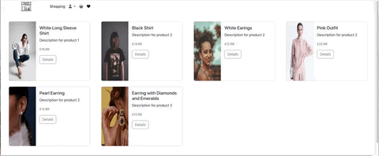

# Shopping New 

This project is a web application built with Flask for the backend and uses SQLite as the database. The application provides an online store for products, allowing users to view products, add them to their favorites or basket, and make purchases.

## Deployed Application

View the deployed site [here](https://shopping-new-fc5cc05d42d1.herokuapp.com/).

## Sign up and create new account or try this demo user:
- Username: mmmmm
- Password: 12345

## Application Visuals

<p align="center">
  
  
 
</p>
<p align="center">
  
  
</p>
<p align="center">
  
  
</p>


## Responsive Design

<p >
  
  
  
</p>


## 🛠 Technologies Used
#### Backend:

- Python

- Flask

- SQLite

#### Frontend:

- HTML

- CSS

- Python

- Bootstrap


#### Development and Deployment

- Flask Debug Toolbar

- Stripe for payment processing

- Git

- GitHub


## Project Brief:

- Objective: Develop a web application for an online Shopping store.
- Backend: Use Python and Flask to create the application. Data is stored in a SQLite database.
- Frontend: Use HTML, CSS, Python and Bootstrap for the user interface.
- Functionality: The application allows users to view products, add products to their basket or favorites, write reviews, and complete purchases.

- Design: Ensure the application has a clean and user-friendly design.
- Deployment: Deploy the application online to make it publicly accessible.


## Build/Code Process:

### Backend:
The backend is built using Flask and handles user authentication, product management, and order processing.

#### Database Models
The database contains several tables to manage users, products, reviews, baskets, orders, and favorites. Here are some key models:


```javascript


import sqlite3

def init_db():
    conn = sqlite3.connect('productdb.db')
    dbCursor = conn.cursor()
    
    dbCursor.execute(
    """ 
        CREATE TABLE IF NOT EXISTS Users (
            user_id INTEGER PRIMARY KEY AUTOINCREMENT,
            username TEXT NOT NULL UNIQUE,
            password TEXT NOT NULL,
            email TEXT NOT NULL UNIQUE
        )"""
    )

    dbCursor.execute(
        """ 
            CREATE TABLE IF NOT EXISTS products (
            id INTEGER PRIMARY KEY AUTOINCREMENT,
            name TEXT NOT NULL,
            description TEXT NOT NULL,
            price REAL NOT NULL,
            image_url TEXT
        )"""
    )
    
    dbCursor.execute(
        """ 
            CREATE TABLE IF NOT EXISTS review (
            Review_id INTEGER PRIMARY KEY AUTOINCREMENT,
            user_id INTEGER,
            product_id INTEGER,
            name TEXT NOT NULL,
            description TEXT NOT NULL,
            FOREIGN KEY (user_id) REFERENCES Users(user_id),
            FOREIGN KEY (product_id) REFERENCES Products(id)
        )"""
    )

    dbCursor.execute(
        """ 
            CREATE TABLE IF NOT EXISTS Basket (
            basket_id INTEGER PRIMARY KEY AUTOINCREMENT,
            user_id INTEGER,
            product_id INTEGER,
            quantity INTEGER,
            FOREIGN KEY (user_id) REFERENCES Users(user_id),
            FOREIGN KEY (product_id) REFERENCES Products(id)
        )"""
    )

    dbCursor.execute(
        """ 
            CREATE TABLE IF NOT EXISTS Orders (
            order_id INTEGER PRIMARY KEY AUTOINCREMENT,
            user_id INTEGER,
            order_date DATETIME,
            total REAL,
            status TEXT,
            FOREIGN KEY (user_id) REFERENCES Users(user_id)
        )"""
    )

    dbCursor.execute(
        """ 
            CREATE TABLE IF NOT EXISTS OrderDetails (
            order_details_id INTEGER PRIMARY KEY AUTOINCREMENT,
            order_id INTEGER,
            product_id INTEGER,
            quantity INTEGER,
            price_at_time_of_order REAL,
            FOREIGN KEY (order_id) REFERENCES Orders(order_id),
            FOREIGN KEY (product_id) REFERENCES Products(id)
        )"""
    )

    dbCursor.execute(
        """ 
            CREATE TABLE IF NOT EXISTS Favorites (
            user_id INTEGER,
            product_id INTEGER,
            PRIMARY KEY (user_id, product_id),
            FOREIGN KEY (user_id) REFERENCES Users(user_id),
            FOREIGN KEY (product_id) REFERENCES Products(id)
        )"""
    )

    conn.commit()
    conn.close()
    
init_db()

```
#### Main Application Logic

The main application file, app.py, handles routes for displaying products, user authentication, basket management, and checkout.

```javascript

from flask import Flask, render_template, request, redirect, url_for, session, flash
import sqlite3 as sql
import bcrypt
from flask_debugtoolbar import DebugToolbarExtension
import stripe
from flask_cors import CORS
import sys

print(sys.path)

app = Flask(__name__)
CORS(app)
app.debug = True
app.config['SECRET_KEY'] = 'your_secret_key_here'
stripe.api_key = 'your_stripe_secret_key_here'

@app.route('/')
def home():
    return render_template('home.html', title="Home Page")

@app.route('/products')
def products():
    members = get_members()
    return render_template('products.html', title="Products Page", members=members)

# Additional routes and functions for handling user login, registration, basket, favorites, and checkout

if __name__ == "__main__":
    app.run()
```

### Frontend:

The frontend uses HTML, CSS, and Bootstrap to create a responsive and user-friendly interface. Templates are rendered using Flask's render_template method.


#### Base Template
The base.html template includes the common structure and styles for the application.

```javascript

<!DOCTYPE html>
<html lang="en">
<head>
    <meta charset="UTF-8" />
    <meta name="viewport" content="width=device-width, initial-scale=1.0" />
    <title>{{ title | default('Wine Library') }}</title>
    <link href="https://cdn.jsdelivr.net/npm/bootstrap@5.3.3/dist/css/bootstrap.min.css" rel="stylesheet" />
    <link rel="stylesheet" href="{{ url_for('static', filename='css/style.css') }}" />
</head>
<body>
    <header>
        <!-- Navbar -->
    </header>
    <section></section>
    <script src="https://cdn.jsdelivr.net/npm/bootstrap@5.3.3/dist/js/bootstrap.min.js"></script>
</body>
</html>

```
#### Product Card Component

The product card component displays each product along with its details and functionality. This includes viewing product details, adding products to the basket, adding products to favorites, and handling various user interactions.

#### Icons & Overlays

To enhance the user experience, custom icons have been integrated into the product card design. These icons provide visual cues for actions such as adding a product to the basket, adding to favorites, and viewing product details.

The following icons and functionalities are included:

- #### Add to Basket:  
  Represented by a shopping basket icon. Clicking this icon allows users to add the selected product to their basket. 
- #### Add to Favorites: 
  Represented by a heart icon. Clicking this icon adds the product to the user's favorites list.
- #### View Details: 
  Represented by a details button. Clicking this button navigates to the product detail page where users can view more information about the product.

By incorporating these thoughtfully designed visual elements, the application aims to create an intuitive and user-friendly experience. Users can easily identify and engage with the relevant icons, enabling them to perform actions such as adding products to the basket with ease.

#### Product Details and Adding to Basket
The product card component includes functionality for viewing detailed information about a product and adding the product to the basket. This is achieved through the following steps:

1. #### View Product Details:

 - When users click the "Details" button, they are redirected to the product detail page.
 - The product detail page displays extensive information about the product, including its description, price, and available payment plans.

2. #### Add to Basket:

 - Users can select the desired quantity of the product and click the "Add to Basket" button to add the product to their shopping basket.

 - This action triggers the "add_to_basket" function, which updates the basket with the selected product and quantity.

#### Code Snippet
Below is the HTML and JavaScript code used to implement the product card functionality:

```javascript

<div class="card m-2" style="min-width: 350px; max-width: 650px;">
  <div class="row g-0">
    <div class="col-md-4 col-sm-12 row-md-12 row-sm-4" style="height: 300px">
      
    </div>
    <div class="col-md-8 col-sm-12 row-md-12 row-sm-8" style="background-color: #f8f9fa; height: 300px;">
      <div class="card-body">
        <h5 class="card-title">{{ member[1] }}</h5>
        <p class="card-text">{{ member[2] }}</p>
        <p class="card-text">
          <small class="text-body-secondary">£{{ member[3] }}</small>
        </p>
        <a class="btn btn-outline-secondary" href="{{ url_for('product', member_id=member[0]) }}">Details</a>
      </div>
    </div>
  </div>
</div>
```
#### Review Section
The product detail page includes a section for customer reviews, allowing users to read and leave reviews for the product. This enhances user engagement and provides valuable feedback for potential buyers.

1. #### Displaying Reviews:

 - Reviews are displayed below the product details, with each review showing the title and content.
 - Users can toggle the visibility of the review section by clicking an icon.

2. #### Adding a Review:

 - Logged-in users can add their own reviews by filling out a form with the review title and content.

 - This action triggers the "update_comments" function, which updates the database with the new review.

#### Code Snippet

```javascript
<div style="position:relative;">
  <h4 style="border-bottom:1px solid black; padding:0.5em 1em; margin:20px 3.5em;">Review</h4>
  <a onclick="toggleComments();">
    
  </a>
</div>

  <div id="commentsSection" style="display: none; height:100%; padding:0.5em 1em; margin:20px 4em; transition:1s ease;">
    
      <h6 class="mb-3">{{ comment[3] }}:</h6>
      <p style="height:100px; border-bottom:1px solid #d9d9d9; font-size:0.8em;">{{ comment[4] }}</p>
    
  </div>
  
    <form action="{{ url_for('update_comments', user_id=session['user_id'], product_id=member[0]) }}" method="post" style="padding:0.5em 1em; margin:20px 4em;">
      <input type="hidden" name="action" value="update">
      <label for="name" class="form-label mb-2">Title</label>
      <input type="text" name="name" class="form-control mb-3" id="name">
      <label for="description" class="form-label mb-2">Comment</label>
      <textarea class="form-control mb-3" name="description" id="description" rows="3"></textarea>
      <button type="submit" class="btn btn-outline-secondary">Add Comment</button>
    </form>
  

```
By implementing these features, the product card component provides a seamless and engaging shopping experience for users, allowing them to easily view product details, add products to their basket or favorites, and read or leave reviews.


## Wins & challenges

#### Wins: 

- Community Engagement: The project significantly enhanced community engagement by enabling users to share and explore personal travel stories, enriching the platform with diverse experiences and insights.

- Technical Integration: Technical integrations, including real-time data handling and media uploads, showcased the project's robust backend architecture and contributed to a seamless user experience.

- User Interface Design: The adaptive and responsive design of the application ensured optimal usability across various devices, broadening accessibility and enhancing user interaction.


#### challenges:

- Managing state efficiently across multiple React components proved challenging. Using global state management solutions like Redux or Context API was essential to share data and handle asynchronous operations without causing performance issues or inconsistent states.

- Ensuring secure user authentication and authorization was complex. Implementing JWT for secure token handling, protecting frontend routes, and managing role-based access control to differentiate admin and user permissions added significant complexity.


#### Key Learnings:

- One key learning was the importance of thorough testing throughout the development process. Implementing unit tests and integration tests early on helped identify bugs and issues before they became major problems. This proactive approach saved time and ensured a more stable and reliable application.

##### Unit Testing: 
When developing the city search functionality, I created unit tests for the search function to ensure it correctly filtered cities based on user input.

```javascript

    import { searchCities } from './search';

test('filters cities based on search query', () => {
  const cities = [{ name: 'New York' }, { name: 'Los Angeles' }, { name: 'Chicago' }];
  const result = searchCities(cities, 'New');
  expect(result).toEqual([{ name: 'New York' }]);
});
```
##### Integration Testing:

For the user authentication feature, I wrote integration tests to verify that the  login API endpoint worked correctly with the database and responded with appropriate status codes.

```javascript
import request from 'supertest';
import app from './app';

describe('POST /login', () => {
  it('should login user and return a token', async () => {
    const response = await request(app)
      .post('/login')
      .send({ username: 'testuser', password: 'testpassword' });
    expect(response.statusCode).toBe(200);
    expect(response.body).toHaveProperty('token');
  });
});
```
- Another significant learning experience was leveraging external libraries and APIs to enhance functionality. Integrating libraries like Axios for HTTP requests and Cloudinary for image uploads streamlined development and added powerful features without reinventing the wheel.


#### Future Improvements:

- Code Refactoring and Optimization:
  To enhance code organization and readability, I aim to refactor and optimize the codebase. Specifically, improving the structure and readability of complex components like CityCard and TourBrowse, and utilizing proper destructuring and modularization techniques. This will make the code more maintainable and easier for other developers to understand and contribute to.

  
##### Example:

  - Current Code:


```javascript

const CityCard = ({ city }) => {
  return (
    <div>
      <h3>{city.name}</h3>
      <p>{city.text}</p>
      
    </div>
  );
};

```


  - Improved Code:

```javascript

  const CityCard = ({ city: { name, text, image } }) => (
  <div>
    <h3>{name}</h3>
    <p>{text}</p>
    
  </div>
 );

```

- Enhanced User Profiles:
 A significant future enhancement is to develop a comprehensive user profile feature. This would allow users to create and personalize their profiles, showcasing their travel stories and experiences. Additionally, integrating social features like following other users and commenting on profiles would increase engagement and community interaction.

  ##### Example:
  - Current Code: No user profile feature implemented.


  - Improved Code:

  ```javascript

  const UserProfile = () => {
  // Fetch user data from API
  const [userData, setUserData] = useState(null);

  useEffect(() => {
    fetchUserData().then(data => setUserData(data));
  }, []);

  if (!userData) {
    return <div>Loading...</div>;
  }

  return (
    <div>
      <h1>{userData.name}</h1>
      
      <p>{userData.bio}</p>
      {/* Additional user details and functionalities */}
    </div>
  );};

  export default UserProfile;
   ```


